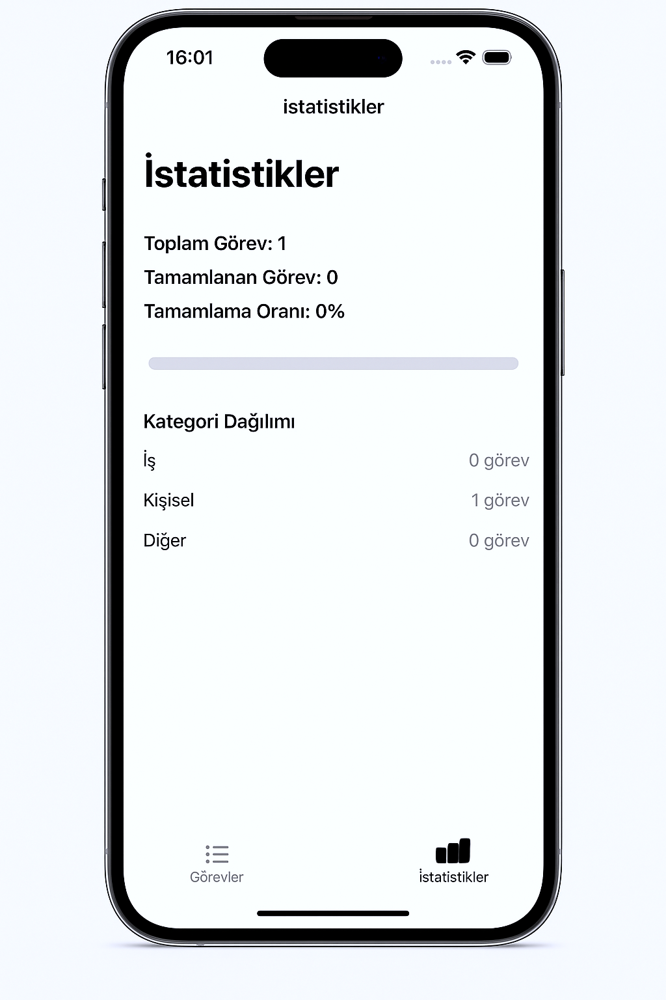
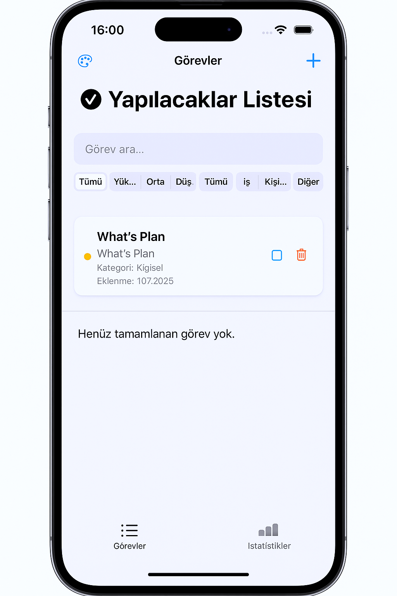

# Taskify

## Genel Bakış
Taskify, iOS platformu için tasarlanmış bir görev yönetimi uygulamasıdır. Günlük işlerinizi organize etmenize, önceliklendirmenize ve takip etmenize yardımcı olur. Tema özelleştirme, bildirim hatırlatıcıları ve widget desteği gibi özelliklerle verimliliğinizi artırır.

## Özellikler
- **Görev Yönetimi**: Yeni görevler ekleyin, düzenleyin ve silin.
- **Öncelik ve Kategori**: Görevlere öncelik (Yüksek, Orta, Düşük) ve kategori (İş, Kişisel, Diğer) atayın.
- **Tema Özelleştirme**: Açık, Koyu ve Mavi tema seçenekleri.
- **Bildirimler**: Son tarihler için otomatik hatırlatıcılar.
- **İstatistikler**: Tamamlama oranınızı ve kategori dağılımını görün.

## 📸 Ekran Görüntüleri

### 📊 İstatistik Ekranı

### ✅ Görevler Ekranı

## Kullanım
- Yeni görev eklemek için "+" butonuna basın.
- Görev durumunu değiştirmek için "Tamamla" butonuna dokunun.

## Lisans
MIT Lisansı altında lisanslanmıştır. Daha fazla bilgi için [LICENSE](LICENSE) dosyasını inceleyin.

## Geliştirici
- **Ad**: Yusuf Ege Eren
- **GitHub**: [eegeren](https://github.com/eegeren)
- **İletişim**: yusufege.erenn@gmail.com

## Gelecek Planlar
- Siri ile daha fazla komut ekleme.
- Ses efekti desteği.
- Grafik tabanlı istatistikler.
